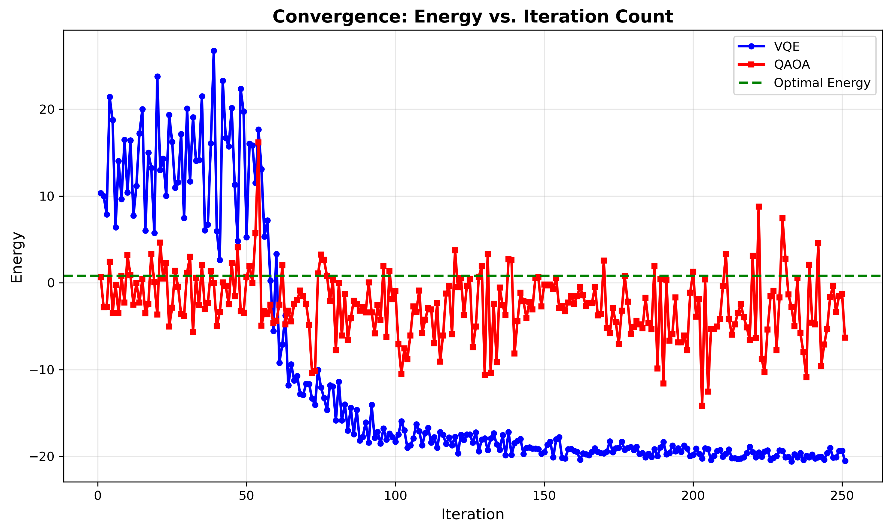
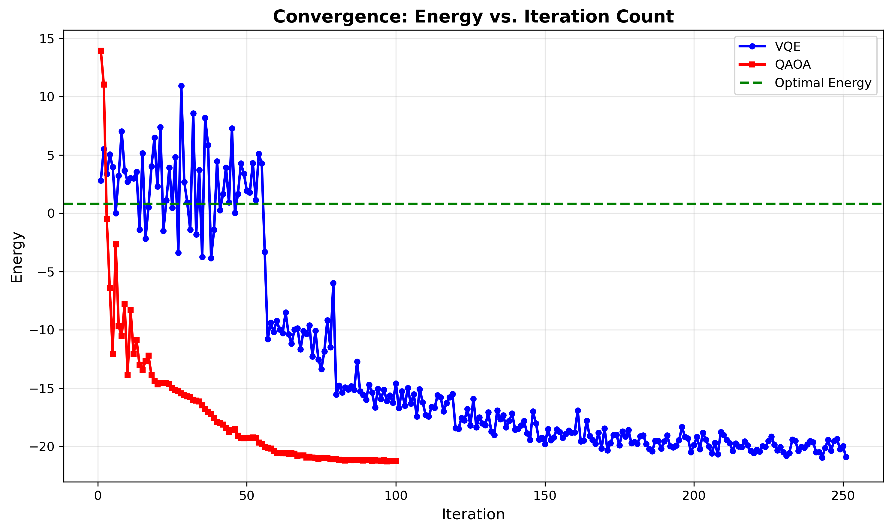
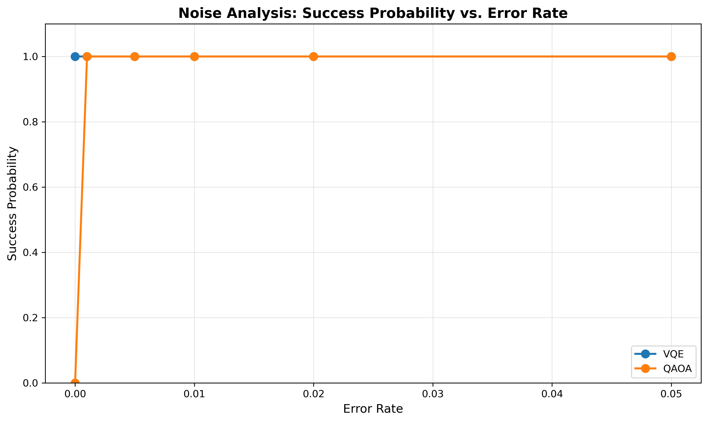
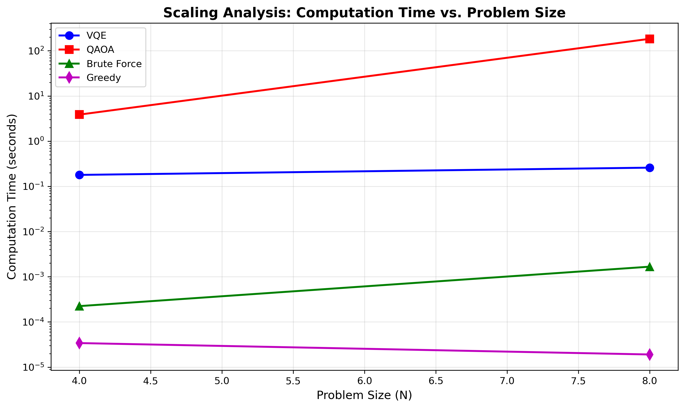

# Quantum-Aegis: A Comparative Study of Quantum Variational Algorithms for Tactical Optimization in Gaming

## Project Overview

This project investigates the application of Variational Quantum Algorithms (VQE and QAOA) to solve combinatorial optimization problems found in competitive gaming environments. Focusing on the "Tactical Position Selection" problem in Apex Legends, we map the scenario to a Quadratic Unconstrained Binary Optimization (QUBO) model.

## Project Structure

```
quantum2/
├── quantum_aegis/          # Main source code package
│   ├── __init__.py
│   ├── problem/            # Problem definition and QUBO formulation
│   │   ├── __init__.py
│   │   ├── qubo.py         # QUBO model and Hamiltonian construction
│   │   └── tactical.py     # Tactical position selection problem
│   ├── solvers/            # Quantum and classical solvers
│   │   ├── __init__.py
│   │   ├── quantum/        # Quantum solvers (VQE, QAOA)
│   │   │   ├── __init__.py
│   │   │   ├── vqe.py
│   │   │   └── qaoa.py
│   │   └── classical/      # Classical solvers (Brute Force, Greedy)
│   │       ├── __init__.py
│   │       ├── brute_force.py
│   │       └── greedy.py
│   ├── noise/              # Noise models and analysis
│   │   ├── __init__.py
│   │   └── models.py
│   └── utils/              # Utility functions
│       ├── __init__.py
│       └── visualization.py
├── notebooks/              # Jupyter notebooks for experiments
│   └── experiments.ipynb  # Main experimental demonstration
├── requirements.txt        # Python dependencies
└── README.md              # This file
```

## Installation

```bash
pip install -r requirements.txt
```

## Usage

See `notebooks/experiments.ipynb` for the main experimental demonstration including:
- Convergence plots (Energy vs. Iteration count for VQE and QAOA)
- Scaling graphs (Computation time vs. Problem Size N)
- Noise analysis (Success probability rates under varying error rates)

## results
### Phase I: Algorithmic Implementation
  
### Phase II: Noise Resilience & Tuning
The graph below primarily shows the impact of optimizers SPSA and COBYLA on VQE computation. Blue represents the impact of SPSA on VQE, and red represents the impact of COBYLA on VQE.

#### Noise Analysis: Success Probability vs. Error Rate

### Phase III: Scaling Analysis (Quantum vs. Classical)

## Author

BOYU LIU

## Course

Course Code: 76636-01 – Quantum Computation and Error Correction

## Date

December 24, 2025

